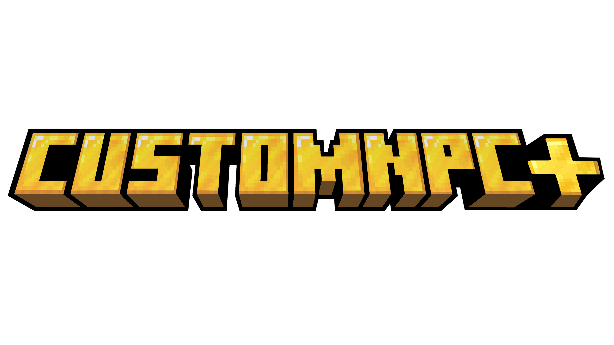
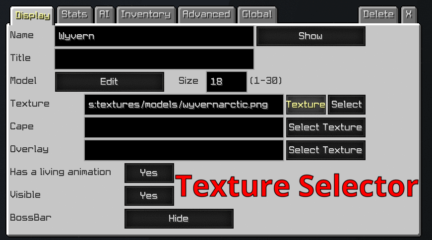
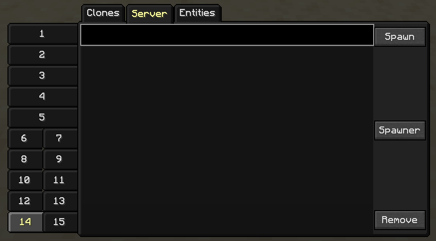

## 👋 Welcome to the CustomNPC+ Repository.
  

> CustomNPC+ is a [Minecraft](https://minecraft.net/) mod that allows you to add custom NPCs to your world. It is developed for creative and storytelling players who want to make their Minecraft worlds more in-depth and unique. CustomNPC+ is only a branch version of the **1.7.10** Forge version of the original (down below) and has no plans to add or update any other version. This is not an official version of CustomNPC.

**CurseForge**: [Download](https://www.curseforge.com/minecraft/mc-mods/customnpc-plus)

### ❗ Notice
I am not the original creator of CustomNPC. The original creator is @[Noppes](https://github.com/Noppes). I have been permitted to update the 1.7.10 and post my results on GitHub. The original mod that is updated to the latest versions of Minecraft can be found on these links: [CurseForge](https://www.curseforge.com/minecraft/mc-mods/custom-npcs), [kodevelopment](http://www.kodevelopment.nl/minecraft/customnpcs)

### 🔹 Installation
This mod is an ***update*** to CustomNPC and not an add-on. Do not install CustomNPC with CustomNPC-Plus. CustomNPC-Plus does not remove any functional features from the original mod. It expands upon CustomNPC with original features and backported features from newer versions. Simply drag CustomNPC-Plus into any client/server mods folder to utilize. Please **backup** before using as this could still have unforeseen errors. Report any bugs if found, thank you and enjoy.

### ❓ Features:
- Flying NPC (Smart Pathfinding)
- 1.8 Skin Support (64x64) (3D Bodywear)
- Full URL64 Selector (Downloads FULL Size Images for Custom Mob Skins)
- Alex Model (64x64)
- Additional Parts: [Wings, Fins, Capes, Horns, Tail]
- Hide Body Parts [Arms, Legs, Head, Body]
- Custom Overlays
- Updated Cloner GUI (with more Tabs!)
- Markov Name Generator
- Backported GUI Features
- Dark Mode GUI (Link Below)
- 1.12 Scripting Features (Details below)
- Script Logging (See Config)

#### Scripting:
- CustomNPC+ Api: [API](https://github.com/KAMKEEL/CustomNPC-Plus-API)
- Java Doc: [kamkeel.github.io/CustomNPC-Plus](https://kamkeel.github.io/CustomNPC-Plus/)
- Scripted Items
- Player Overlays
- Script Timers
- Global Scripts
- GUI Overlays
(We never remove script functionality, only add on existing functions)

## 🔰 Skin Model Feature:
###### **Majority of these cape designs are taken from the internet with fair-usage.*
##### ❔ Please note all *local* skins in this version of CustomNPC, must match the model selected.

#### Flying NPCs:

#### Url64:

#### DarkMode + Cloner GUI:

## 🔗 Want to check out my other projects?
[Plugin Mod](https://github.com/KAMKEEL/Plugin-Mod) is a mod designed to add more aesthetic items for RPG and storytelling. It is compatible with CustomNPC+ and has many items intended to be used and wielded by created NPCs.

[RPG Messenger](https://github.com/KAMKEEL/RPGMessenger) is a bukkit plugin designed to allow operators to create messagable NPCs for RPG Servers. Allows a 'RPG Controller' to reply quickly as NPCs, form groupchats, and messagable parties.

[CustomNPC+ Dark Mode](https://github.com/KAMKEEL/CustomNPC-Plus-Dark-Mode) is a resource pack for CustomNPC+ that alters all GUIs within the mod to a dark variant that is both clean and pleasing to look at.

## Cloning / Compiling / Building

git clone call `git submodule update --init --recursive`

Using IntelliJ, take the following steps: 
1. Run `setupDecompWorkspace` under the `forgegradle` tab.
2. Refresh Gradle.
3. Run `genIntellijRuns` under the `other` tab to set up your Minecraft runs.

or for Eclipse, run `gradlew setupDecompWorkspace eclipse` then import the project. 

Mixin code will not work if you do not add `--tweakClass org.spongepowered.asm.launch.MixinTweaker --mixin customnpcs.mixins.json` to your program arguments.
