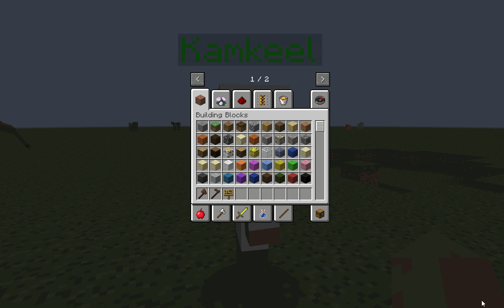

## 👋 Welcome to the CustomNPC+ Repository.
  

> CustomNPC+ is a [Minecraft](https://minecraft.net/) mod that allows you to add custom NPCs to your world. It is developed for creative and storytelling players who want to make their Minecraft worlds more in-depth and unique. CustomNPC+ is only a branch version of the **1.7.10** Forge version of the original (down below) and has no plans to add or update any other version. This is not an official version of CustomNPC.

Link to CurseForge: [HERE](https://www.curseforge.com/minecraft/mc-mods/customnpc-plus)

### ❗ Notice
I am not the original creator of CustomNPC. The original creator is @[Noppes](https://github.com/Noppes). I have been permitted to update the 1.7.10 and post my results on GitHub. The original mod that is updated to the latest versions of Minecraft can be found on these links: [CurseForge](https://www.curseforge.com/minecraft/mc-mods/custom-npcs), [kodevelopment](http://www.kodevelopment.nl/minecraft/customnpcs)

### 🔹 Installation
This mod is an ***update*** to CustomNPC and not an add-on. Do not install CustomNPC with CustomNPC-Plus. CustomNPC-Plus does not remove any functional features from the original mod. It expands upon CustomNPC with original features and backported features from newer versions. Simply drag CustomNPC-Plus into any client/server mods folder to utilize. Please **backup** before using as this could still have unforeseen errors. Report any bugs if found, thank you and enjoy.

### ❓ Features:
- More Wing Types
- More Fin Types
- More Capes*
- More Overlays
- Added Horns
- Added Dolphin Tail
- Larger Clone GUI
- More Clone Tabs
- Increased Resolution to Additional Body Parts
- 64x64 Skin Textures work on all models
- 1.8 Skins  (64x64)
- Alex Model (64x64)
- Fix Part Rendering
- Backported GUI Features
- Backported New Part Models
- Custom Part Disabling
- Markov Name Generator
- Flying NPCS

#### Scripting:
- Scripted Items
- Player Overlays
- GUI Overlays
- Scripting Fixes / New Functions: [Documentation](https://github.com/PewDizinho/CustomNPCPlus-Script-Documentation)
(We never remove script functionality, only add on existing functions)

--- Please Suggest New Features!

## 🔰 Skin Model Feature:
###### **Majority of these cape designs are taken from the internet with fair-usage.*
##### ❔ Please note all *local* skins in this version of CustomNPC, must match the model selected.

#### Scale/Puppet Reset:

#### Url64:

## 🔗 Want to check out my other projects?
[MorePlayerModels+](https://github.com/KAMKEEL/MorePlayerModels-Plus) is a continuation on the 1.7.10 MorePlayerModels version. It is not intended to be as polished as CustomNPC+. It will feature Alex, Steve64x64 skins. Hiding Body Parts. Advanced URL Selector. 3D Skins.

[Plugin Mod](https://github.com/KAMKEEL/Plugin-Mod) is a mod designed to add more aesthetic items for RPG and storytelling. It is compatible with CustomNPC+ and has many items intended to be used and wielded by created NPCs.

[RPG Messenger](https://github.com/KAMKEEL/RPGMessenger) is a bukkit plugin designed to allow operators to create messagable NPCs for RPG Servers. Allows a 'RPG Controller' to reply quickly as NPCs, form groupchats, and messagable parties.

[CustomNPC+ Dark Mode](https://github.com/KAMKEEL/CustomNPC-Plus-Dark-Mode) is a resource pack for CustomNPC+ that alters all GUIs within the mod to a dark variant that is both clean and pleasing to look at.

