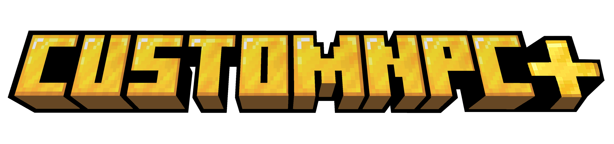

# CustomNPC+

**CustomNPC+** is a Minecraft 1.7.10 Forge mod that lets you create fully customizable NPCs with advanced AI, combat abilities, quests, dialogs, scripting, an economy system, and much more. Built for creative and storytelling players who want to transform their worlds into living RPG experiences.

> CustomNPC+ is a branch version of the original [CustomNPC](https://www.curseforge.com/minecraft/mc-mods/custom-npcs) by [Noppes](https://github.com/Noppes), developed with permission. This is not an official version of CustomNPC.

---

<a href="https://discord.gg/pQqRTvFeJ5">  </a>

[](https://modrinth.com/mod/customnpc-plus)
[](https://www.curseforge.com/minecraft/mc-mods/moreplayermodels-plus)
[](https://github.com/KAMKEEL/Plugin-Mod)

---

## Installation

CustomNPC+ is a **replacement** for the original CustomNPC — not an add-on. Do not install both together. Simply drop CustomNPC+ into your client or server mods folder. All original CustomNPC features are preserved and expanded upon.

> Please **backup your world** before installing. Report any bugs on the [issue tracker](https://github.com/KAMKEEL/CustomNPC-Plus/issues).

### Downloads

- **Modrinth**: [Download](https://modrinth.com/mod/customnpc-plus)
- **CurseForge**: [Download](https://www.curseforge.com/minecraft/mc-mods/customnpc-plus)

---

<a href="https://ko-fi.com/kamkeel">  </a>

> More betas with new features will continue to be released to supporters for **Early Access** to new content!

---

## Feature Overview

### NPC Creation & Customization

Create NPCs with deep visual customization and lifelike behavior.

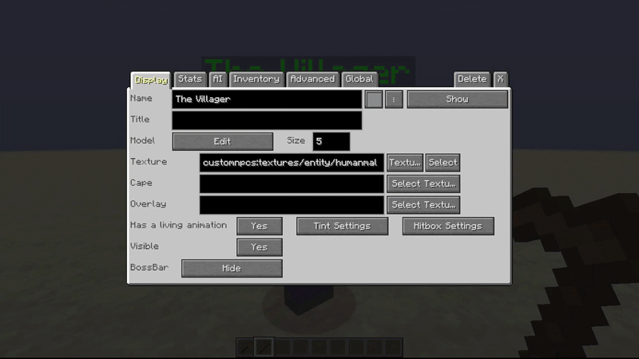

- **Skin System** - 1.8 skin support (64x64), Alex & Steve64 models, full URL64 selector that downloads full-size images for custom skins
- **Body Parts** - Wings, fins, capes, horns, tails. Hide individual body parts (arms, legs, head, body)
- **Skin Overlays** - Layer additional textures on top of the base skin with color tinting and alpha control
- **Custom Models** - Support for custom model formats, plus Gecko and DBC addon model integration
- **Hitbox Scaling** - Independently scale NPC hitbox width and height
- **Tint System** - Control hurt flash color and apply persistent color tints

---

### NPC AI & Behavior

NPCs have a full AI system for combat, pathing, and interaction.

- **Flying NPCs** - Smart pathfinding in 3D space for flying entities
- **Combat AI** - Multiple tactical behaviors: attack, ranged attack, ambush, pounce, dodge-shoot, zigzag, stalk, orbit, sprint-to-target, and leap attacks
- **Movement Types** - Standing, wandering, and moving path modes
- **Pathfinding** - Ground, flying, and water navigation
- **Door Interaction** - NPCs can break, open, or ignore doors
- **Behavior Controls** - Configurable sprinting, swimming, fire reactions, tactical chance, and walking range
- **Attack Speed** - NPCs respect attack speed timing when dealing damage
- **Faction Awareness** - NPCs respond to faction standings. Passive faction NPCs are protected from damage


---

### NPC Roles & Jobs

**Roles** give NPCs interactive functions — Trader, Follower, Bank, Transporter, Postman, Companion, Mount, and Auctioneer. **Jobs** give NPCs background tasks — Bard, Healer, Guard, Item Giver, Follower, Spawner, Conversation, and Chunk Loader.

---

### Dialog System

Create branching dialog trees for storytelling and player interaction.

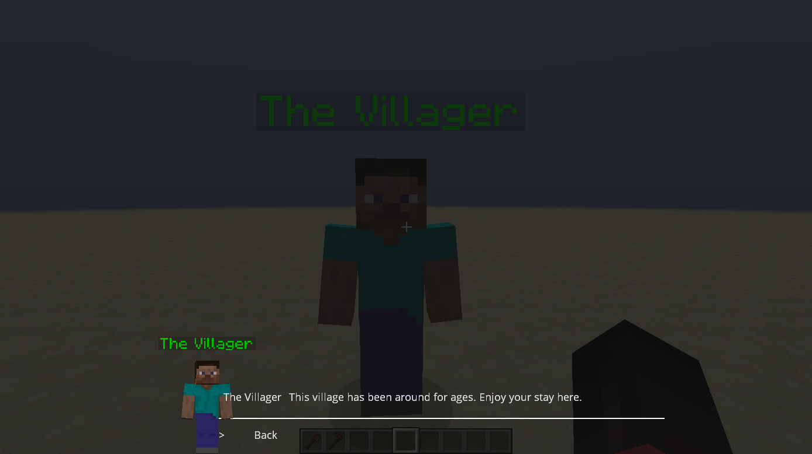

- **Dialog Trees** - Multi-level branching conversations with unlimited depth
- **Dialog Options** - Player choices that affect outcomes, trigger quests, or change faction standings
- **Dialog Images** - Display images alongside dialog text
- **Dialog Colors** - Customizable text and background colors
- **Categories** - Organize dialogs into categories for large projects
- **Availability Conditions** - Show or hide dialogs based on quests, factions, items, or custom conditions
- **Script Hooks** - Full scripting support for dialog open, close, and option events

---

### Quest System

A complete quest framework for RPG progression.

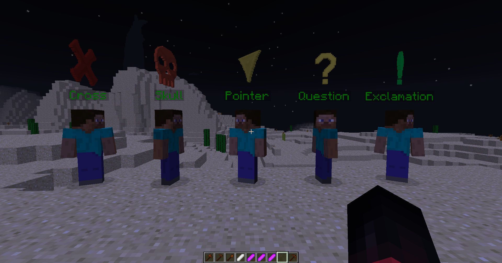

- **Quest Types** - Item collection, dialog completion, kill targets, reach locations, area kills, and fully manual (script-driven) quests
- **Quest Tracking** - On-screen HUD overlay showing active quest objectives
- **Categories** - Organize quests into categories
- **Rewards** - Configure item, XP, and currency rewards
- **Cooldowns** - Repeatable quests with MC time, real-time, or custom cooldown intervals
- **Party Quests** - Share quest objectives across party members with configurable sharing modes
- **Availability** - Control quest visibility based on completed quests, faction standing, dialogs, and more
- **Script Hooks** - Events for quest start, completion, turn-in, and custom quest objectives

---

### Ability System

A full combat ability system for both NPCs and players.

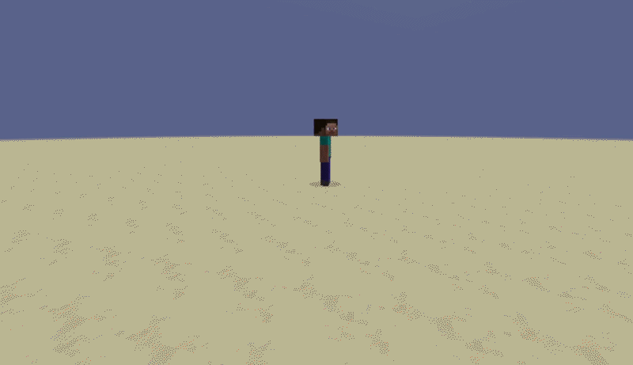
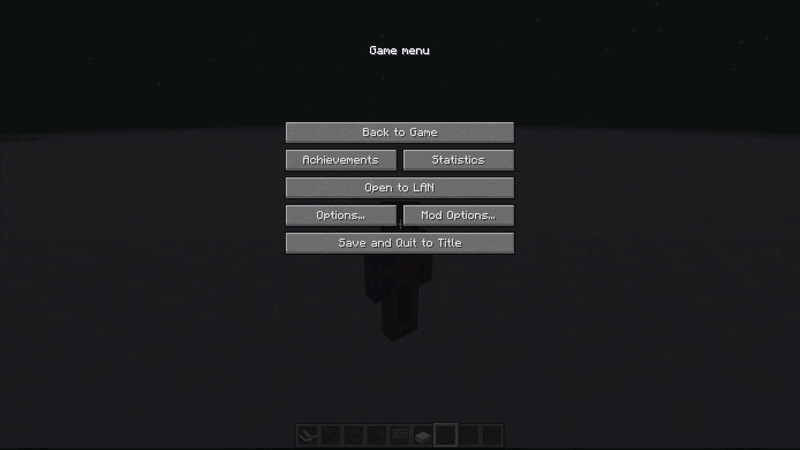

**Melee Abilities** - Slam, Heavy Hit, Cutter
**Energy Projectiles** - Orbs, Discs, Beams, Laser Shots with full visual customization, homing, and hit types
**Energy Barriers** - Domes, Walls, Shields with HP, reflection, and damage absorption
**Defensive** - Guard, Counter, Dodge with configurable damage reduction and counter-attacks
**Movement** - Charge, Dash, Teleport
**AOE** - Shockwave, Sweeper, Vortex
**Hazards & Traps** - Persistent damage zones and proximity-triggered traps with visual presets
**Support** - Ability Effect for healing, buffs, and debuffs

**Key Features:**
- Phase-based execution (Wind-up, Active, Dazed) with visual telegraphs
- Burst system for rapid multi-fire
- Chained abilities for sequential combos
- Player ability hotbar (12 slots) with unlock system
- Full scripting API for every lifecycle event
- Live preview in the ability editor

---

### Auction House & Economy

A complete marketplace and economy system.

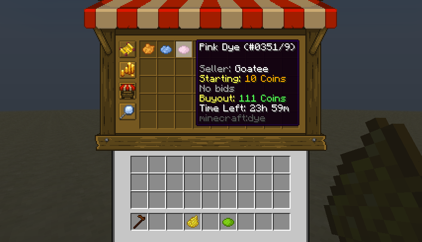

- **Built-in Currency** - Configurable currency with starting balance, max cap, and Vault plugin integration
- **Auction House** - Global player marketplace with bidding, buyout, snipe protection, and notifications
- **Trade Slots** - Configurable per-player slot limits via permissions
- **Item Blacklist** - Block items by name, wildcard, mod, or NBT tag from being listed
- **Admin Tools** - Dedicated admin GUI for managing listings and creating server auctions
- **Scripting API** - Cancelable events for creates, bids, buyouts, cancels, and claims

**Trader Enhancements:**
- Limited stock with automatic restocking (MC time, real-time, or custom intervals)
- Global or per-player stock modes
- Currency costs on top of item trades
- Client-side balance preview

---

### Script Editor

A full-featured code editor built right into Minecraft.

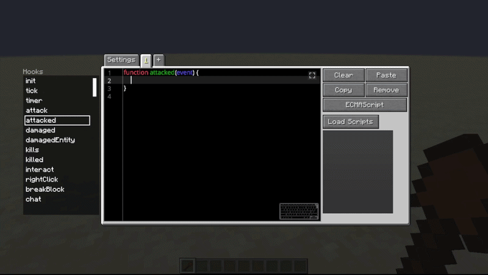

- **Syntax Highlighting** - Color-coded keywords, types, variables, methods, strings, and comments
- **Autocomplete** - Smart suggestions with type awareness, static vs instance context, and auto-imports
- **Error Detection** - Real-time underlining of wrong argument types, missing methods, type mismatches, and unused imports
- **Hover Info** - Full type information, documentation, and JSDoc rendering on hover
- **Navigation** - Go to line, search & replace, go to definition, and fullscreen mode
- **Editing** - Smart undo/redo, duplicate lines, comment toggle, rename refactoring, smart bracket pairing
- **Visual** - Line numbers, smooth scrolling, indent guides, brace matching, resizable panels

---

### Scripting

Write scripts in **JavaScript** or **Java** to control every aspect of the mod.

- **Java Scripting** - Write real Java code compiled by the Janino engine. Full support for classes, generics, lambdas, and method references
- **JavaScript** - Full Nashorn-based JavaScript with ECMAScript 5.1 globals (Math, JSON, Date, Number)
- **Client-Side Scripting** - Run scripts on the client for responsive visual experiences (server-controlled)
- **154+ Script Hooks** - Events for NPCs, players, blocks, items, quests, dialogs, factions, abilities, auction, animations, and more
- **Script Types** - NPC, Player, Global, Block, Item, Linked Item, Effect, Ability, Recipe, and Forge Event scripts
- **Scripted Blocks** - Blocks with full script hooks for click, redstone, neighbor changes, and more
- **Scripted Items** - Items with use, attack, toss, pickup, and durability hooks
- **Custom GUIs** - Build custom interfaces with buttons, text fields, scroll panels, and slots via scripting
- **GUI Overlays** - Persistent on-screen overlays with labels, lines, and textured rectangles
- **Addon API** - Mods can ship `.d.ts` type definitions for full autocomplete in the editor

**Resources:**
- API Repository: [CustomNPC+ API](https://github.com/KAMKEEL/CustomNPC-Plus-API)
- Java Docs: [kamkeel.github.io/CustomNPC-Plus](https://kamkeel.github.io/CustomNPC-Plus/)

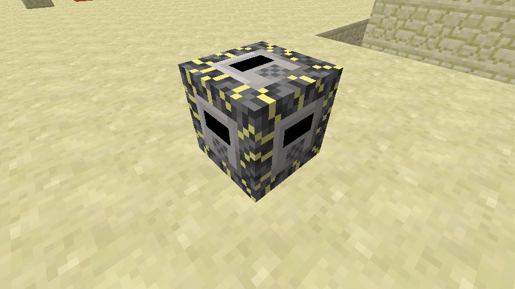
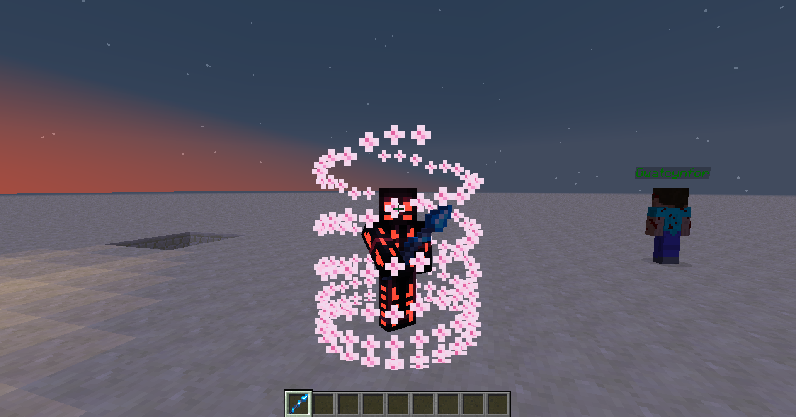

---

### Animation System

Create custom animations for NPCs directly in-game.

- **Animation Maker** - Visual editor for creating frame-based animations
- **Animation Parts** - Animate individual body parts with rotation, position, and scaling
- **Frame Events** - Script hooks for animation start, end, frame enter, and frame exit
- **Data Store** - Animations can store and pass data across events and frames
- **Task System** - Consumer-based callbacks for animation lifecycle
- **Built-in Animations** - Pre-made animations for abilities that work automatically
- **Multiple Registrations** - Register multiple animations under one common name
- **Animated Textures** - Frame-based animated textures for items, effects, and ability icons

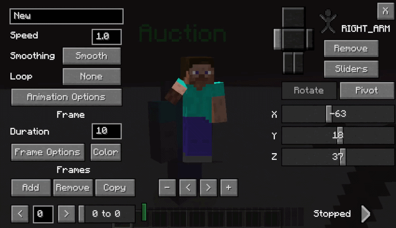

---

### Custom Effects

Create custom status effects beyond vanilla potions.

- **Custom Icons** - Each effect gets its own texture, with support for animated icons
- **Script Hooks** - Events for effect apply, tick, and removal
- **Ability Integration** - Abilities can apply custom effects to targets
- **Condition System** - Check if entities have specific effects for ability or availability conditions

---

### Profile System

Multiple character slots on a single account.

- **Profile Slots** - Each slot stores separate quest progress, dialogs, factions, currency, abilities, and effects
- **Region Locking** - Lock profiles to specific areas
- **Soulbound Items** - Bind items to a specific player by UUID
- **Profile-Slotbound Items** - Bind items to a specific profile slot

---

### Party System

Group up with other players for cooperative gameplay.

- **Party Management** - Invite, kick, leave, disband, and transfer leadership
- **Quest Sharing** - Share quest objectives across party members
- **Ability Integration** - Party members are treated as allies for AOE ability targeting
- **Script Hooks** - Events for invites, kicks, leaves, disbands, and quest completion

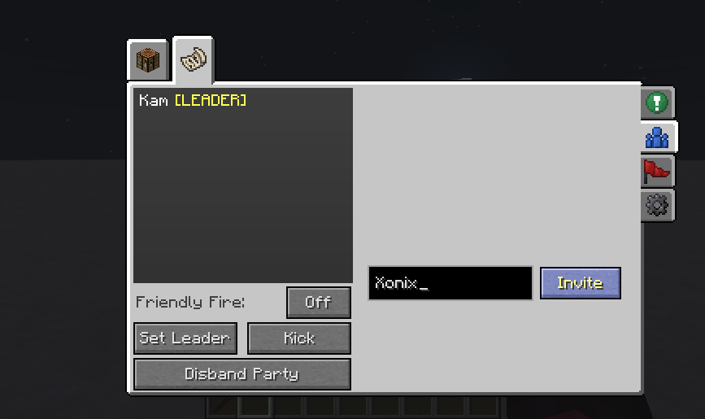
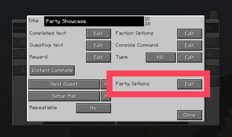

---

### Faction System

Create factions to control NPC relationships and player reputation.

- **Faction Points** - Players earn or lose standing with factions through quests, combat, and scripting
- **Availability Conditions** - Gate dialogs, quests, and content behind faction thresholds
- **NPC Behavior** - NPCs react to players based on faction standing (friendly, neutral, hostile)
- **Passive Factions** - Passive faction NPCs are protected from damage

---

### HUD System

Customizable on-screen elements.

- **HUD Editor** - Drag and position HUD components to fit your screen
- **Ability Hotbar** - 12-slot bar with horizontal/vertical layout and configurable visible slots
- **Quest Tracking** - On-screen quest objective tracker
- **Compass** - Directional compass with quest and waypoint markers
- **Effect Bar** - Display active custom effects

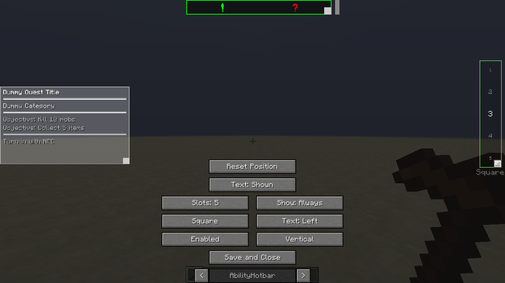

---

### Cloner & Organization

Save, organize, and reuse NPCs and content.

- **Cloner Tabs** - Save and load NPCs, items, and other content
- **Folder System** - Organize with folders and subfolders for animations, abilities, forms, auras, outlines, effects, and linked items
- **Quick Tags** - Tag-based filtering for fast searching
- **Full Screen Browser** - Wide directory view for large collections

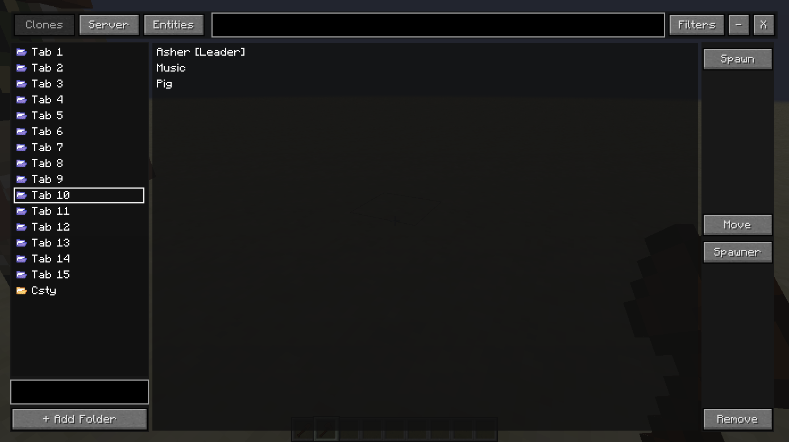

---

### Items & Blocks

A large library of custom items and decorative blocks.

**Weapons:** Battle Axe, Broadsword, Claw, Crossbow, Dagger, Staff, Glaive, Gun, Kunai, Scythe, Spear, Wand, Warhammer, Musket, and more

**Linked Items:** Create custom items with configurable attack speed, scripted behavior, animated textures, and item versioning

**Blocks:** Banners, barrels, beams, signs, campfires, candles, chairs, couches, crates, crystals, lanterns, mailboxes, pedestals, redstone blocks, and scripted blocks

**Crafting:** Carpentry Bench and Anvil with custom recipe support

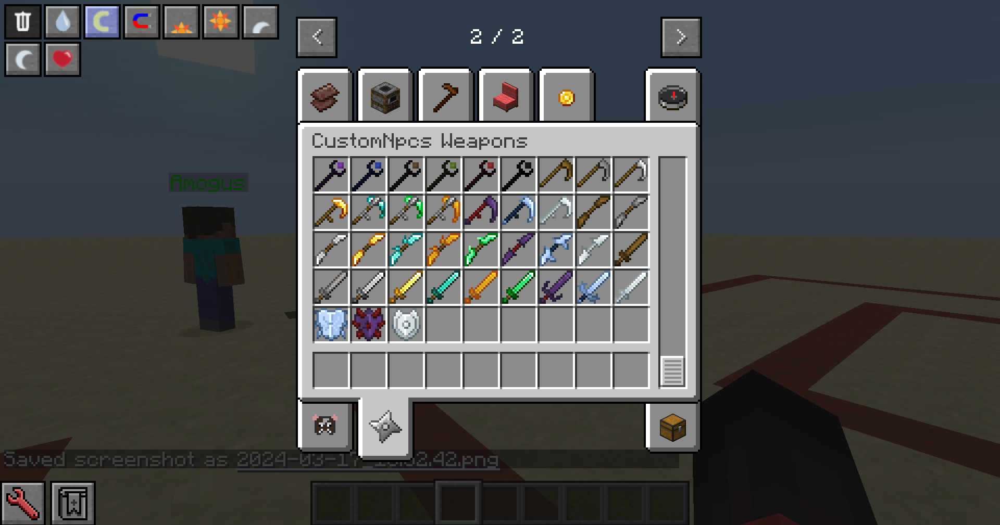
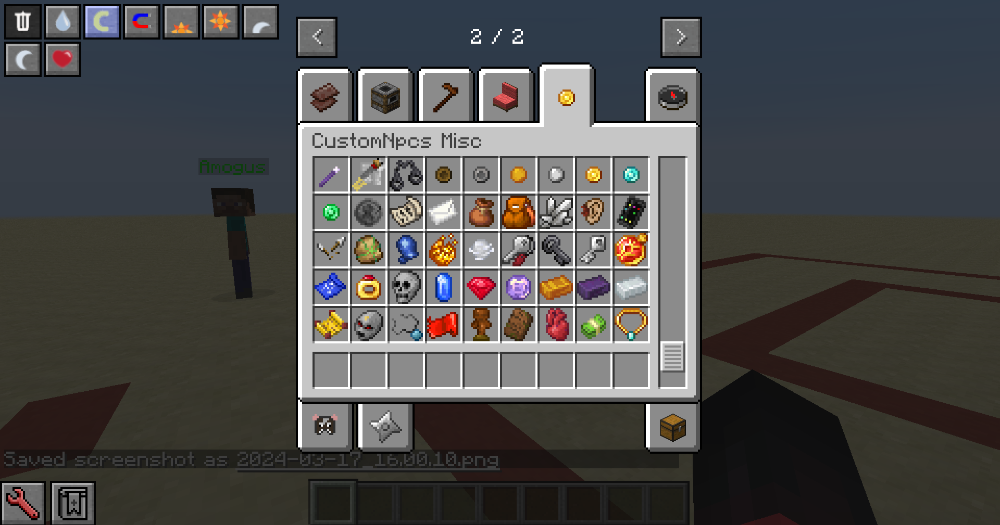

---

### Custom Models

Support for custom NPC models beyond the default humanoid. Import Blockbench models using the **Gecko Addon** (GeckoLib integration) or use **Armorer's Workshop** skins with the AW Addon.

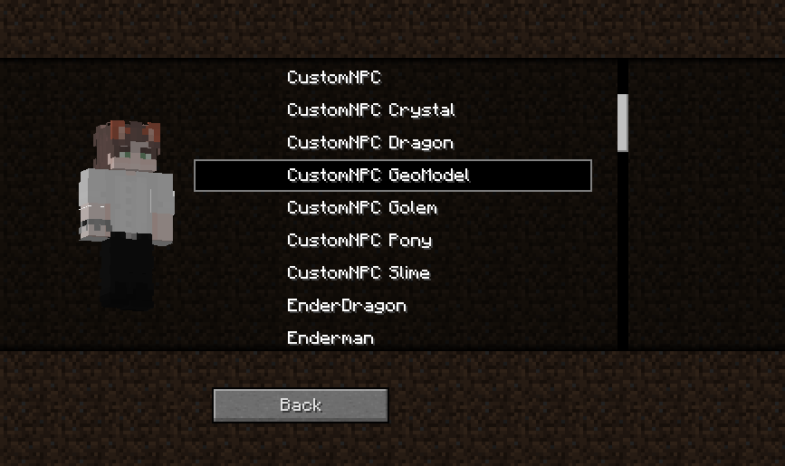
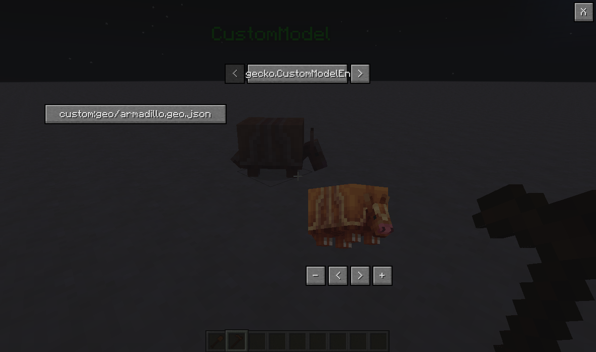

---

### Addon Compatibility

CustomNPC+ has official addons that extend its functionality with other mods. Vault and Pixelmon are also supported natively for economy and scripting integration.

---

## Official CNPC+ Addons

### DBC Addon

Adds full compatibility between [Dragon Block C](https://www.curseforge.com/minecraft/mc-mods/dragon-block-c) and CustomNPC+. Extends abilities with ki-based attacks, adds DBC stat integration to conditions, and enables DBC model/animation support on NPCs.

[](https://www.curseforge.com/minecraft/mc-mods/cnpc-dbc-addon)
[](https://modrinth.com/mod/customnpc-plus-dbc-addon)
[](https://github.com/KAMKEEL/CustomNPC-DBC-Addon)

### Gecko Addon

Adds [GeckoLib](https://www.curseforge.com/minecraft/mc-mods/geckolib) support to CustomNPC+. Import Blockbench models directly into the mod and use them as custom NPC models with full animation support.

[](https://www.curseforge.com/minecraft/mc-mods/cnpc-custom-model-addon)
[](https://modrinth.com/mod/customnpc-plus-gecko-addon)
[](https://github.com/KAMKEEL/CustomNPC-Gecko-Addon)

### Armorer's Workshop Addon

Adds compatibility between [Armorer's Workshop](https://www.curseforge.com/minecraft/mc-mods/armorers-workshop) and CustomNPC+. Use Armorer's Workshop skins and equipment on NPCs with custom rotation, scaling, and animation support. Requires UniMixins.

[](https://www.curseforge.com/minecraft/mc-mods/cnpc-armorers-workshop-addon)
[](https://modrinth.com/mod/customnpc-plus-aw-addon)

---

## Other Projects

### MorePlayerModels+

An updated continuation of MorePlayerModels for 1.7.10 with backported GUIs, original parts and customizations, and permission support. Works alongside CustomNPC+. This is a replacement — do not install alongside the original MorePlayerModels.

[](https://www.curseforge.com/minecraft/mc-mods/moreplayermodels-plus)
[](https://modrinth.com/mod/moreplayermodels+)
[](https://github.com/KAMKEEL/MorePlayerModels-Plus)

### The Plugin Mod

Adds aesthetic weapons, artifacts, blocks, and apples for RPG and storytelling servers. Designed to pair with CustomNPC+ — use the included swords, spears, axes, medpacks, and decorative blocks to make your NPCs and worlds more diverse.

[](https://www.curseforge.com/minecraft/mc-mods/the-plugin-mod)
[](https://modrinth.com/mod/the-plugin-mod)
[](https://github.com/KAMKEEL/Plugin-Mod)

### HexText

Upgrades Minecraft's font renderer with full RGB hex color support, nested color spans, and animated text effects (glow, shake, wave). Works in signs, anvils, and chat. Requires UniMixins.

[](https://www.curseforge.com/minecraft/mc-mods/hex-text)
[](https://modrinth.com/mod/hex-text)
[](https://github.com/KAMKEEL/HexText)

### RPG Messenger

A Bukkit plugin for messageable NPCs, group chats, and RPG controller tools. Allows operators to create NPCs that players can message, and lets RPG controllers reply as NPCs in real-time.

[](https://github.com/KAMKEEL/RPGMessenger)

### CustomNPC+ Dark Mode

A resource pack that applies a clean dark theme to all CustomNPC+ GUIs.

[](https://github.com/KAMKEEL/CustomNPC-Plus-Dark-Mode)

---

## Configuration

CustomNPC+ has a modular configuration system:

| Config | Purpose |
|--------|---------|
| **Main** | Core mod settings |
| **Client** | Client-side display and UI preferences |
| **Script** | Scripting engine settings and client script toggle |
| **Market** | Currency, auction house, trader, and economy settings |
| **Energy** | Energy projectile settings (explosion block damage, dome item blacklist) |
| **Item** | Item and gun configuration |
| **Debug** | Debug logging and diagnostics |
| **Experimental** | Experimental features toggle |

---

## Building from Source

This project uses the [GTNH Gradle Convention](https://github.com/GTNewHorizons/ExampleMod1.7.10) build system with [RetroFuturaGradle](https://github.com/GTNewHorizons/RetroFuturaGradle).

```bash
git clone <repo-url>
git submodule update --init --recursive
./gradlew build
```

That's it. Submodules pull in the API sources, and `build` handles decompilation, compilation, and mixin embedding automatically.

**Run the game:**
```bash
./gradlew runClient          # Launch client
./gradlew runServer          # Launch server
```

**IDE Setup (IntelliJ):**
1. Import the project as a Gradle project
2. Run `./gradlew genIntellijRuns`
3. Add program arguments: `--tweakClass org.spongepowered.asm.launch.MixinTweaker --mixin customnpcs.mixins.json`

---

## Notice

I am not the original creator of CustomNPC. The original creator is [Noppes](https://github.com/Noppes). I have been permitted to update and develop my own branch version for 1.7.10. The original mod updated to the latest Minecraft versions can be found on [CurseForge](https://www.curseforge.com/minecraft/mc-mods/custom-npcs) and [kodevelopment](http://www.kodevelopment.nl/minecraft/customnpcs).
